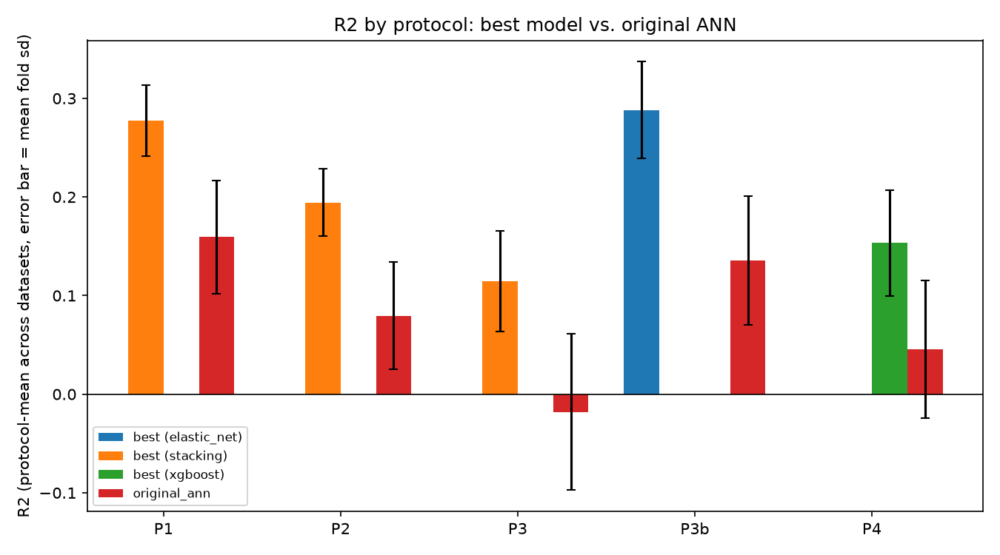

# Engineering Identity

Predicts a first-year engineering student's composite Engineering Identity score (-50 to +50) from a start- and end-of-semester survey, three written definitions of an engineer, and a hand-drawn concept map turned into 29 graph-complexity metrics.

It rebuilds a study I worked on at UT Dallas, Aug 2024 to Jun 2025, roughly 1,900 students, so the results can be reproduced and checked against the original pipeline instead of just cited.



## How it works

- Reimplements both of the original pipelines, a MATLAB "wisdom of the crowd" ensemble (189 architectures x 100 replications) and a Keras ANN, and scores them on the same cross-validation folds as this repo's own models, elastic net, random forest, XGBoost, and a stacked ensemble of the three.

- Seven survey items are single-item self-ratings that closely track the four subscales the target score sums, interest, recognition, performance, and initiative. Alone, with no model at all, those seven items reach R^2 = 0.35 against the target, and removing them from the feature set drops the best model's R^2 from 0.417 to 0.294. That is protocol P1 (with the proxy items) versus P2 (without) in the results table below, and it is the single largest effect in the whole study.

- The honest version of the task is prediction, not fitting. Using only start-of-semester answers to predict the end-of-semester score, protocol P3, drops R^2 to 0.115. Even a model handed the student's own before-semester score directly, P3b, only reaches 0.288, which looks like a persistence effect, this student already had a stable identity level, not evidence that semester-over-semester change itself is predictable.

- The concept-map complexity metrics do not add measurable signal once the survey and definition features are already in the model, holding the cohort fixed to only students with a digitized concept map (protocol P4).

## Results

| Protocol | Best model | R^2 (best) | original_ann R^2 |
|---|---|---:|---:|
| P1 replication (includes proxy items) | stacking | 0.417 +/- 0.040 (p1_after) | 0.281 +/- 0.027 |
| P2 no proxy items (honest, leakage-free) | stacking | 0.294 +/- 0.030 (p2_after) | 0.186 +/- 0.029 |
| P3 true prediction (before -> after) | stacking | 0.115 +/- 0.051 | -0.018 +/- 0.079 |
| P3b persistence baseline (+ before EI) | elastic_net | 0.288 +/- 0.049 | 0.136 +/- 0.065 |
| P4 complete subset (concept-map cohort) | xgboost | 0.133 +/- 0.045 (best dataset) | -0.011 +/- 0.059 |

The MATLAB "wisdom of the crowd" baseline scores R^2 = 0.140 on its own training data and R^2 = -0.075 held out, on a reconstructed 44-feature run. It is not directly comparable to the numbers above, since it uses a different, smaller feature set. Full tables, methodology, every model tried, and the numbers that would not reproduce from the original run are in [`docs/experiments.md`](docs/experiments.md).

## Data

The study data is human-subjects research data and is not in this repo, ever. The code reads de-identified tables from `EI_DATA_DIR`, and tests run on synthetic data generated by `tests/fixtures/synthetic.py`. [`docs/data.md`](docs/data.md) describes the tables in aggregate only, no participant-level values.

## Run it

```bash
pip install -e ".[dev]"
pytest
ruff check .
EI_DATA_DIR=/path/to/tables python -m ei_model.experiments run --config configs/replication.yaml
```

The test suite runs entirely on synthetic fixture data and passes without `EI_DATA_DIR` set.

MIT licensed.
